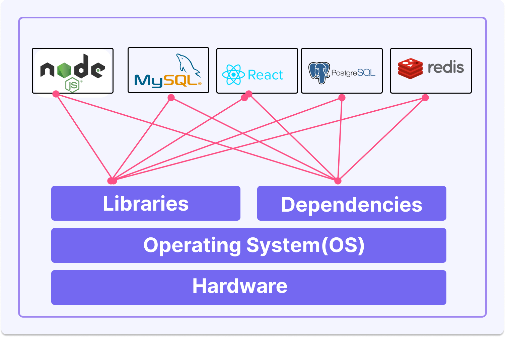
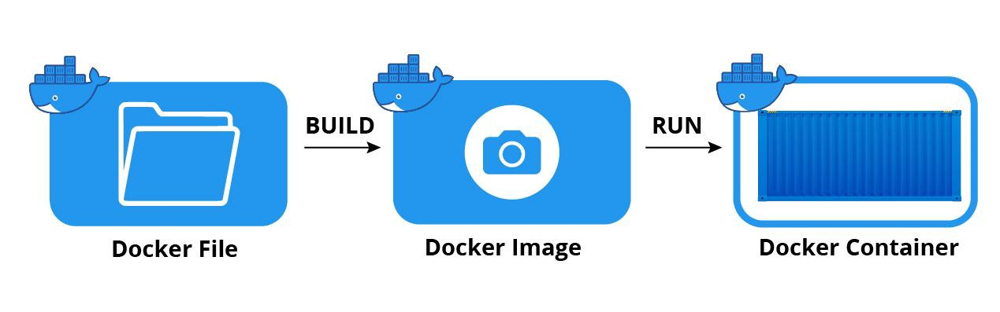
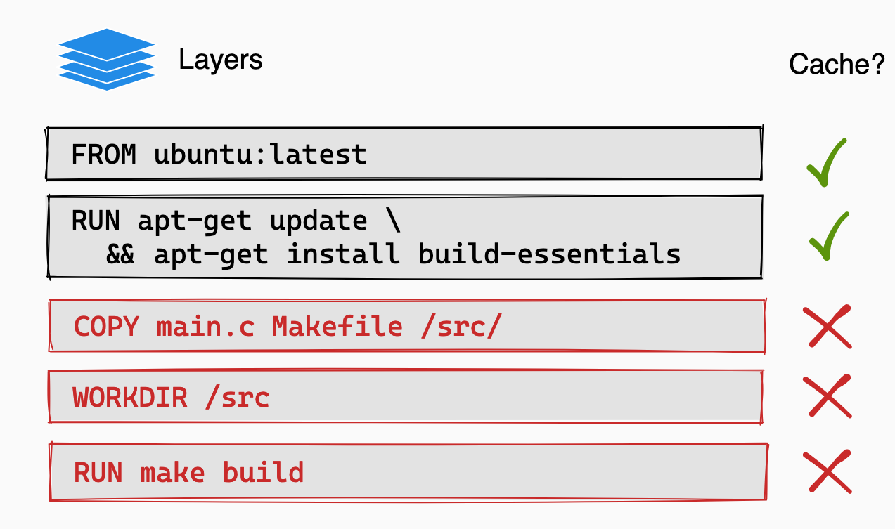
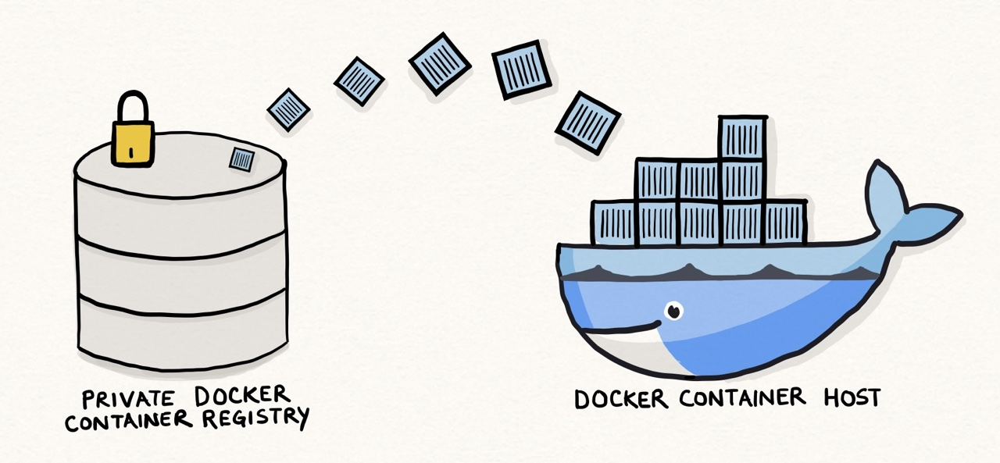
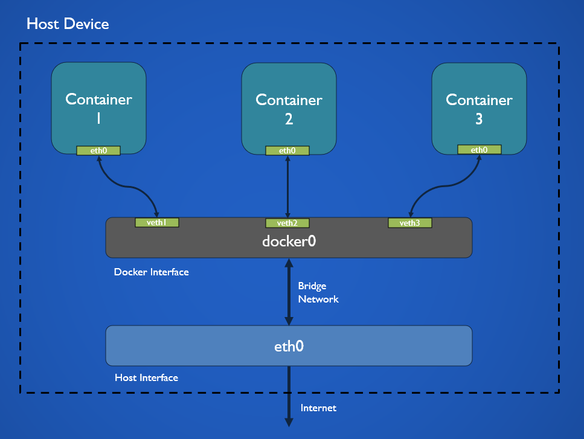
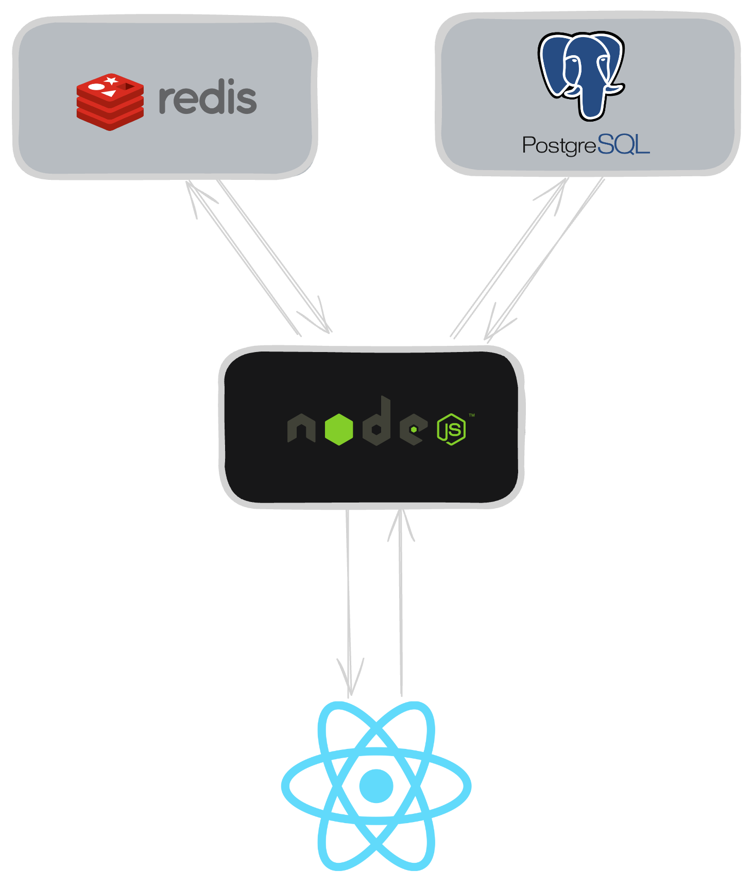

theme: titillium
footer: workshop / Samuel Farkas
autoscale: true

# [fit] What the f is Container?

- Introduction to Docker
  - What is Container?
  - Why and how docker?
  - Container vs VM
- Core docker concepts
  - Images
  - Registry
  - Volumes
- Development with Docker
  - Dockerfile
  - Docker Compose
  - Multi-stage builds
- Best practices and tips
- Next steps

---

### Introduction to Docker

#### Why Docker?

- "Docker enables separation of applications from infrastructure"
- Solves "works on my machine" problem, "dependency matrix hell", ...
- "Isolated environments"

---

### Introduction to Docker

#### Why Docker?


---

### Introduction to Docker

#### Why Docker?

[.column]

- Abstract problems with underlying infrastructure (OS, Deps, Libs, Configs,..)
- Consistency across environments, "works on my machine" (Images)
- Applications are isolated with all dependencies needed (Containers)
- Lighter than VMs (shared OS Kernel)

[.column]
[.quote: alignment(right)]


> -- Dependency Matrix Hell

---

### Introduction to Docker

#### How Docker?

[.column]


[.column]
[.autoscale]

- Infrastructure
  - CPUs, memory, storage
  - Your machine / physical server or cloud
- Host OS
  - Provides core services for interaction with HW
  - Docker was built primarily for Linux (most efficient platform to run Docker)
  - On Windows and MacOS, it uses virtualization like WSL2 / HyperKit because these OS does not support Linux Kernel (virtualization layer)
- Docker (Runtime / Engine)
  - Acts as a container runtime
  - Manages lifecycle (start, stop, monitoring)
  - Creates **lightweight** isolation of containers so they run independently - **Namespaces** and **cgroups** (Linux Kernel features)
  - Manages images, volumes, networks
- Containers
  - Lightweight and isolated units
  - Makes apps consistent across environments (by running single image)
    - Solves "It works on my machine"
  - Every app runs independently from others without interfering from others

---

### Introduction to Docker

#### Virtual Machine vs. Container

[.column]

#### VM

- VM runs a full guest OS on top of the hypervisor (virtualization layer between HW and OS)
- Provides complete hardware-level virtualization
- Strong isolation (separate OS)
- Less portable due hypervisor compatibility and size (full OS + app)
- Loads in minutes, takes a lot of memory (GBs)

[.column]

#### Container

- Isolated environment that run on top of shared host OS kernel
- Packs only user-space OS with basic utilities (e.g. Alpine Linux base image)
- Provides process-level isolation
  - Shared kernel, leverages namespaces and cgroups
- Highly portable (runs anywhere, where something like docker runs)
- Bundle everything application needs, excluding OS Kernel
- Loads in seconds, takes a little bit of memory (MBs)

---

### Core Concepts

#### Docker Image

[.column]

- Lightweight and immutable **blueprint** for creating a Container
- Contains **code**, **dependencies**, **configs** and **user-space** OS
- Built from **Dockerfile** and stored in **registry**
- Provides **consistency** and **reusability**
- Image is composed from **layers**

```bash
docker pull / build / run
docker image ls
```

[.column]


---

### Docker Image

#### Layers

[.column]

- Each layer represents an instruction defined in **Dockerfile**.
- Layers are **immutable**, **cached** and **shared** across images.
- Most layers represent file system changes (e.g., added, modified, or deleted files), while others just modify only image metadata.
- Types:
  - **Base Image** e.g `alpine` or `node` - `FROM`
  - **Application-specific layers** - `RUN`, `COPY`, `ADD`
  - **Configuration layers** - `ENV`, `WORKDIR` (Stored as metadata)
  - **Command or Entrypoint Layers** - `CMD`, `ENTRYPOINT`

```bash
docker image history
```

[.column]


---

### Core Concepts

#### Docker Registry

[.column]

- Storage and distribution system for Docker Images
- Enables **pulling** of images via `docker pull`
- Public / Private registries
- Docker Hub / Github Container Registry

[.column]


---

### Core Concepts

#### Docker Volume

[.column]

- Volume is a mechanism that allows persistance of data generated or used by containers.
- Containers lose all data and state when removed; volumes enable data to persist independently and be reused by new containers.
- Used for databases, logs, application data and file storage.
- They are stored on host's file-system (e.g. /var/lib/docker/volumes).
- Types:
  - **Anonymous Volumes** - automaticaly created by Docker, temporary storage, removed with container
  - **Named Volumes** - explicitly created, reusable
  - **Bind mounts** - maps directories from host (computer running docker engine) to a container
    - Commonly used for live updates of the source code inside container

```bash
docker volume rm / prune / ls
```

[.column]


---

### Core Concepts

#### Docker Network

[.column]

- Docker network allows container to communicate with each other and external systems.
- Provides isolation, security and connectivity for Docker Containers.
- We will mostly use `bridge` type of the Docker Network, but there are also other types.
- Bridge is basically "virtual switch"
- Inter-Container Communication
- docker0 vs custom bridge

[.column]


---

### Development with Docker

#### Project overview



---

### Development with Docker

#### Writing a Dockerfile

- Dockerfile is a set of instructions used to build a Docker Image
- Once written, it can be used to build images for dev, stage and prod.

```bash
docker build -t app:1.0 .
docker run --detached --expose 80:4200 app:1.0
docker ps
```

---

### Development with Docker

#### Docker Compose

- Docker compose is a tool for defining and running multi-container applications
- Written as a YAML configuration file
- Mainly used for development purposes only, but could be used on single-host deployments

```bash
docker compose up / down / rm
docker compose ps
```

---

#### Multi-stage builds

- Multi-stage builds are powerful tool to create multiple stages in a single Dockerfile
- Used to reduce image size and complexity by separating build and runtime dependencies

```Dockerfile
# React App (without ssr) dockerfile
FROM node:lts AS build
WORKDIR /app
COPY package* yarn.lock ./
RUN yarn install
COPY public ./public
COPY src ./src
RUN yarn run build

FROM nginx:alpine
COPY --from=build /app/build /usr/share/nginx/html
```

---

### Best practices and tips

- Use official base images (hub.docker.com)
- Leverage image layering and caching
- Minimize the number of layers
- Use multi-stage builds to reduce image size
- Use `.dockerignore` to exclude unnecessary files

---

### Next Steps

- Pushing images to registry
- Containerization (Docker) vs Orchestration (Docker Swarm / Kubernetes)
- Docker Swarm
- Networking
- Security
- Docker Scout
- Docker Extensions
